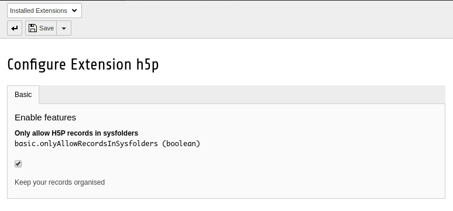

.. include:: ../../Includes.txt

=======================
Extension Configuration
=======================

Use the extension manager to adjust the H5P extension to your needs.

H5P records can be placed on normal pages. You can restrict this so they can only be created in folders.
