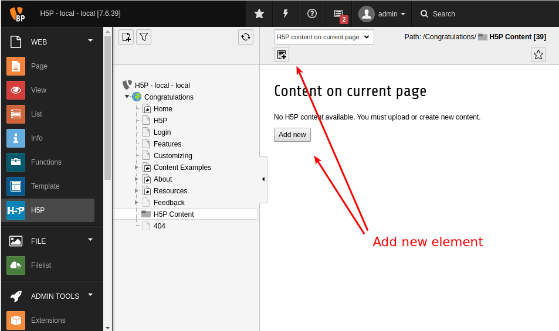
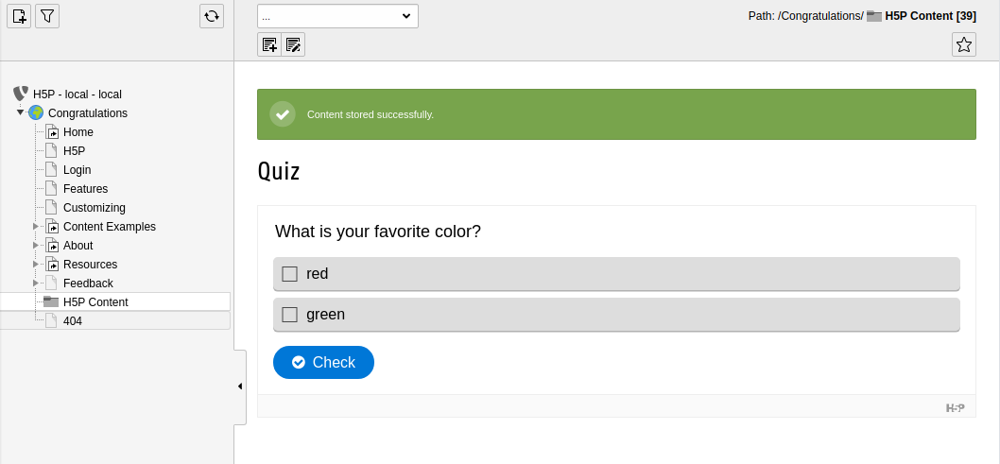
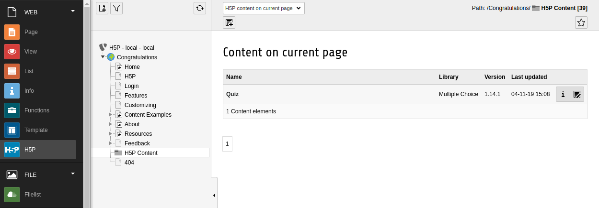
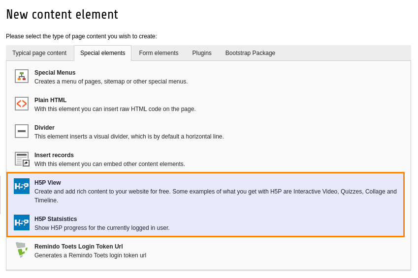
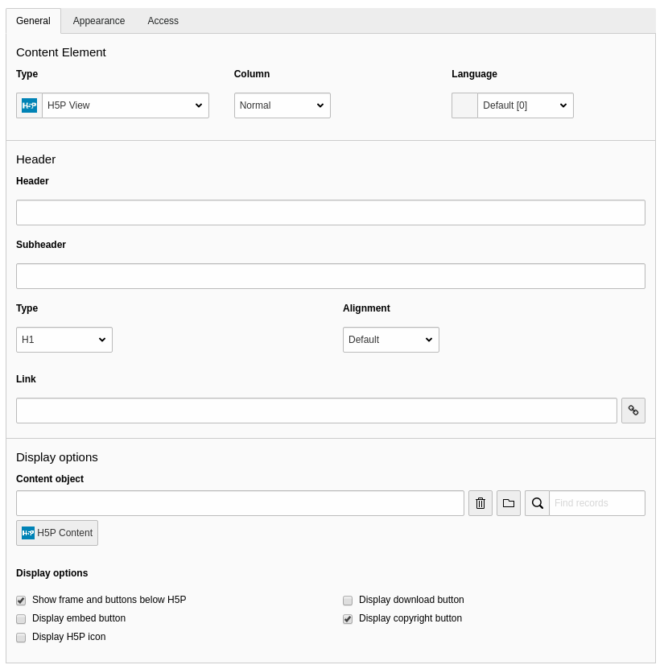

.. include:: ../Includes.txt

.. _integrator-manual:

Integrator Manual
====================

.. _create-an-element:

Creating a H5P content element
==============================

* Select a storage folder from the page tree
* Click the H5P icon
* Click the 'add' icon

* After creating and saving a new element you will see a preview

* Listing the content elements in the folder

Displaying the H5P content in TYPO3
===================================

To display the created H5P element on the site you will need to create a TYPO3 content element of type H5P

The `view` element will render the H5P content

.. toctree::
	:maxdepth: 5
	:titlesonly:
