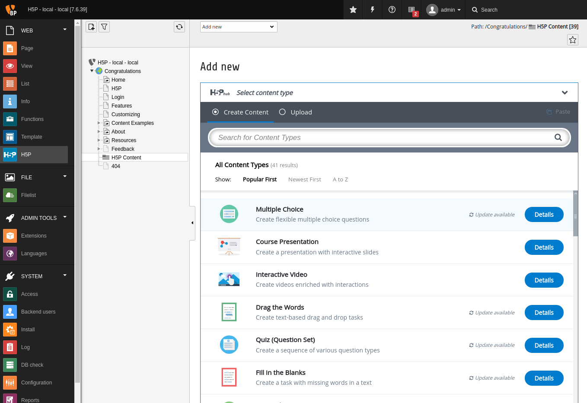

.. include:: ../Includes.txt

.. _introduction:

==============================
Introduction
==============================

`H5P makes it easy to create, share and reuse HTML5 content and applications <https://h5p.org>`_. H5P empowers everyone to create rich and
interactive web experiences more efficiently - all you need is a web browser and a web site with an H5P plugin.

.. _features:

Features
========

* Create Richer HTML5 Content in Existing Publishing Platforms
* Share Content Seamlessly Across Any H5P Capable Site
* Reuse and modify Content in Your Browser at Any Time
* Choose from `over 40 different content types <https://h5p.org/content-types-and-applications>`_

.. _what-it-does:

What does it do?
================

H5P makes it easy to create, share and reuse HTML5 content and applications. H5P empowers everyone to create rich and interactive web experiences more efficiently - all you need is a web browser and a web site with an H5P plugin.

.. _screenshots:

Screenshots
===========

   H5P Hub in TYPO3
